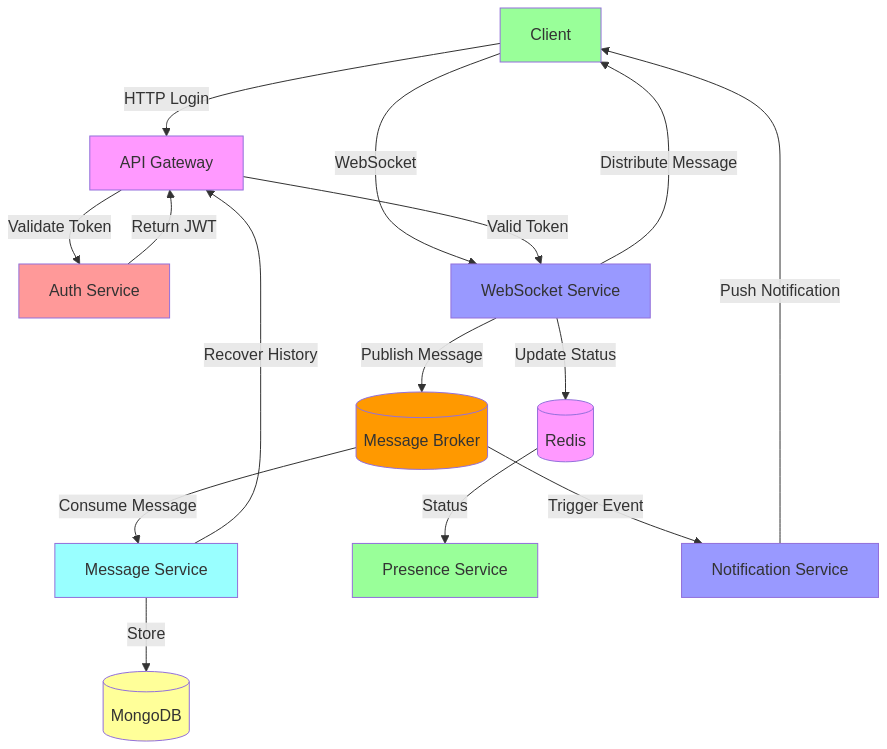

# Real-Time Chat with Microservices 🚀

A scalable real-time chat application built with microservices architecture. Supports instant messaging, presence status, and push notifications.

## Tech Stack 🛠️

| **Microservice**         | **Responsability**                          | **Technologies**        |
| ------------------------ | ------------------------------------------- | ----------------------- |
| **WebSocket Service**    | To handle real-time connections (WebSocket) | Golang + Websockets     |
| **Message Service**      | Store/retrieve messages                     | Golang + MongoDB        |
| **Presence Service**     | Manage user status (online/offline)         | Golanng + Redis         |
| **Auth Service**         | Authenticate users and validate tokens      | Golang + Postgres + JWT |
| **Notification Service** | Notify events (e.g. new messages)           | RabbitMQ                |
| **API Gateway**          | Request routing and management              | NGINX                   |

## Operation Flow 🔧

### **a. Initial User Connection**

1. **Authenntication**:
   - Client sends credentials to **Auth Service** using HTTP
   - The Auth Service returns a **JWT** for access to other services.
2. **WebSocket connection**:
   - API Gateway service validates token using **Public key (RSA)**
   - The client establishes a WebSocket connection with the **WebSocket Service**, including user information in the headers.

### **b. Message Sending**

1. The client sends a message via WebSocket.
2. The **WebSocket Service** publishes the message to a **message broker**.
3. The **WebSocket Service** consumes the message from the broker and send it to the users.
4. The **Message Service** consumes the message from the broker and persists it to the database.
5. The **Notification Service** consumes the message from the broker and notify users.

### **c. Presence Status**

1. When a user connects, the WebSocket Service notifies the **Presence Service** updates its status to "online" (e.g. using Redis to store state).
2. When disconnecting, the WebSocket Service notifies the **Presence Service** to update the status to "offline".

### **d. Notifications**

- The **Notification Service** listens to broker events (e.g. new message) and sends push notifications

## 3. Communication Between Services

- **Synchronous (HTTP/REST/gRPC)**:
- Refresh token validation, message history query.
- **Asynchronous (Message Broker)**:
- Message events, status updates and notifications.
- **WebSocket**:
- Real-time communication between client and server.
